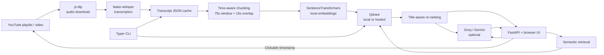

# YT Lecture RAG

**Timestamp-level Retrieval-Augmented Generation for Pratyush's DSA YouTube lectures.**

YT Lecture RAG lets you search a lecture corpus semantically and jump directly to the moment where a topic was explained. It combines local speech-to-text, time-aware chunking, sentence embeddings, Qdrant vector search, and an optional Groq/Gemini answer layer with clickable YouTube citations.

> **Core idea:** the timestamp is the product. The system is designed to find *where* a concept was taught, not just generate a plausible explanation of it.

---

## What it does

Given a YouTube playlist of lectures, the pipeline:

1. Resolves the playlist with **yt-dlp**.
2. Downloads audio only, avoiding unnecessary video files.
3. Transcribes lectures with **faster-whisper**.
4. Stores transcripts as local JSON cache files so interrupted runs can resume.
5. Merges transcript segments into **75-second time windows with 15-second overlap**.
6. Drops very short and highly repetitive chunks.
7. Embeds chunks locally with **SentenceTransformers**.
8. Stores vectors and metadata in **Qdrant**.
9. Retrieves the closest lecture moments for a question.
10. Optionally asks **Groq** or **Gemini** to produce a short grounded answer using only the retrieved excerpts.
11. Returns clickable timestamps that open YouTube at the relevant second.

The repository also contains a **prebuilt vector index** and a bundled transcript snapshot, so you can try the search/answer workflow without re-transcribing the full corpus.

---

## Architecture



There are two main query paths:

**Search path**

`question → embedding → Qdrant → re-ranking → ranked timestamps`

No LLM is needed. This makes retrieval fast, cheap, and incapable of generating a hallucinated explanation.

**Answer path**

`question → retrieval → grounded excerpts → Groq/Gemini → cited answer`

The answer layer is deliberately thin: retrieval determines the evidence; the LLM only explains that evidence.

---

## Why this design is different from a generic RAG pipeline

### 1. Chunking happens in the time domain

A normal text splitter can destroy the relationship between text and its original timestamp. Here, Whisper segments are merged into windows without splitting individual segments.

Default:

- Window: **75 seconds**
- Overlap: **15 seconds**
- Minimum chunk size: **15 words**

Each chunk keeps:

- video ID
- lecture title
- start/end seconds
- transcript text
- deterministic chunk ID
- deterministic Qdrant point ID
- YouTube URL with a small timestamp rewind

### 2. Re-retrieval is title-aware

The vector search over-fetches results and then applies a lightweight title-overlap boost.

The search pipeline:

1. Ask Qdrant for at least `max(top_k * 4, 20)` candidates.
2. Convert cosine similarity into cosine distance.
3. Remove results beyond `MAX_DISTANCE`.
4. Compute lexical overlap between the question and lecture title.
5. Subtract a `TITLE_BOOST` from the distance for matching titles.
6. Sort again and return the final top-`k`.

This matters because dense similarity over a long lecture excerpt can be semantically close without being the correct lecture.

### 3. Re-ingesting is idempotent

Chunk IDs are based on:

`video_id:start_second`

They are then converted into deterministic UUIDs for Qdrant. Re-running ingestion therefore **updates existing points instead of creating duplicates**.

### 4. Transcripts are the durable artifact

Transcription is the expensive step. Once a transcript exists, the system can:

- re-chunk it
- switch embedding models
- rebuild the vector index
- export the transcript set
- recover after an interrupted ingest

without downloading or transcribing the lecture again.

### 5. The answer layer has multiple refusal guards

The system does not blindly call the LLM.

It can refuse when:

- retrieval returns no chunks within the configured distance cutoff;
- the LLM explicitly says the excerpts do not cover the topic;
- the LLM returns an answer but uses no citation markers.

The canonical refusal string is:

`Ye topic in lectures me cover nahi hua.`

This is especially important for an educational RAG system: confidently answering an out-of-syllabus question is worse than saying the lectures did not cover it.

---

## Current repository snapshot

The repository currently includes:

- **126 cached transcript JSON files** under `transcripts/`
- a prebuilt vector index at `index/vectors.npz`
- the FastAPI application and browser UI
- the evaluation scaffold under `eval/`

The prebuilt `vectors.npz` is intended to let a new clone restore the shipped index quickly. You still need the embedding model locally because incoming questions must be embedded before they can be searched.

---

## Tech stack

| Layer | Technology |
|---|---|
| Language | Python 3.10+ |
| CLI | Typer + Rich |
| Web API | FastAPI + Uvicorn |
| Frontend | Single-page HTML/CSS/JS served by FastAPI |
| YouTube ingestion | yt-dlp |
| Speech-to-text | faster-whisper |
| Embeddings | SentenceTransformers |
| Vector database | Qdrant |
| LLM providers | Groq or Google Gemini |
| Data format | JSON transcripts + compressed NumPy vector export |

The default embedding model in the current configuration is:

`all-MiniLM-L6-v2` (384 dimensions)

---

## Project structure

```text
Youtube_Transcription_RAG/
├── api/
│   ├── main.py              # FastAPI app + REST endpoints
│   └── static/
│       └── index.html       # Browser UI
├── eval/
│   └── golden.json          # Retrieval/refusal evaluation cases
├── index/
│   └── vectors.npz          # Prebuilt vector export
├── transcripts/              # Bundled transcript snapshot
├── ytrag/
│   ├── answer.py            # Retrieval + grounded answer generation
│   ├── chunk.py             # Time-aware chunking + repetition filter
│   ├── cli.py               # Typer commands
│   ├── config.py            # Environment-driven configuration
│   ├── embed.py             # SentenceTransformer embedder
│   ├── evaluate.py          # Golden-set evaluator
│   ├── index.py             # Qdrant storage/search/re-ranking
│   ├── models.py            # Video / Segment / Chunk models
│   ├── playlist.py          # Playlist listing + audio download
│   ├── transcribe.py        # Whisper transcription + cache
│   └── util.py              # Network checks + retry logic
├── main.py                  # Convenience entrypoint
├── .env                     # Local configuration template
└── uv.lock                  # Locked dependency resolution
```

> Python bytecode directories such as `__pycache__/` are implementation leftovers and are not part of the application logic.

---

# Quick start

## 1. Clone

```bash
git clone https://github.com/ashoka0402/Youtube_Transcription_RAG.git
cd Youtube_Transcription_RAG
```

## 2. Create a virtual environment

### Windows

```powershell
python -m venv .venv
.\.venv\Scripts\Activate.ps1
python -m pip install --upgrade pip
```

### Linux / macOS

```bash
python3 -m venv .venv
source .venv/bin/activate
python -m pip install --upgrade pip
```

Install the runtime dependencies:

```bash
pip install fastapi uvicorn typer rich python-dotenv groq google-genai qdrant-client sentence-transformers faster-whisper yt-dlp
```

The repository currently does not include a `requirements.txt` or `pyproject.toml`, so dependencies are installed explicitly as above. The checked-in `uv.lock` is retained for the project's existing UV workflow.

## 3. Configure environment variables

The project reads configuration from the repo-root `.env`.

At minimum, choose one LLM key if you want generated answers:

```dotenv
GROQ_API_KEY=your_groq_key
```

or:

```dotenv
GEMINI_API_KEY=your_gemini_key
```

You can also set:

```dotenv
YTRAG_LLM_BACKEND=groq
# or: gemini
# or: none

QDRANT_URL=
QDRANT_API_KEY=
```

When `YTRAG_LLM_BACKEND` is not set, backend selection is automatic:

1. Gemini when a Gemini/Google key exists
2. otherwise Groq when a Groq key exists
3. otherwise `none`

**Never commit real API keys.** The repository's checked-in `.env` contains placeholders.

---

# Use the bundled index

The fastest way to try the application is to load the prebuilt vector export:

```bash
python main.py load
```

Then start the web application:

```bash
python main.py serve
```

Open:

```text
http://127.0.0.1:8000
```

The browser UI supports:

- semantic lecture search
- timestamped result cards
- direct YouTube jumps
- optional grounded LLM answers
- inline answer citations
- an embedded YouTube player when the iframe API is available

If a privacy/ad blocker prevents the embedded player from loading, the timestamp links still open the corresponding YouTube URL directly.

---

# Using the CLI

The CLI is available through `main.py`.

## Ask a question

```bash
python main.py ask "time complexity of binary search"
```

Hinglish is supported:

```bash
python main.py ask "binary search ki time complexity kya hoti hai?"
```

Restrict the search to one lecture:

```bash
python main.py ask "recursion ka base case" --video VIDEO_ID
```

Change retrieval depth:

```bash
python main.py ask "dynamic programming" --top-k 8
```

## Search without the LLM

This shows what retrieval actually returns:

```bash
python main.py search "sliding window"
```

Use this when debugging retrieval quality. It exposes distance, lecture, timestamp, and matching text instead of hiding retrieval behind a generated answer.

## Check index state

```bash
python main.py stats
```

This reports:

- collection name
- embedding model
- cached transcript count
- chunk count
- vector dimension
- per-video chunk counts

## Start the server

```bash
python main.py serve
```

Custom host/port:

```bash
python main.py serve --host 0.0.0.0 --port 8080
```

Development reload:

```bash
python main.py serve --reload
```

---

# Ingest a new YouTube playlist

The ingestion pipeline is resumable and designed for long unattended runs.

## Basic ingest

```bash
python main.py ingest --playlist "https://www.youtube.com/playlist?list=YOUR_PLAYLIST_ID"
```

Limit the number of videos:

```bash
python main.py ingest --playlist "PLAYLIST_URL" --limit 5
```

Force re-transcription:

```bash
python main.py ingest --playlist "PLAYLIST_URL" --force
```

Use only already cached transcripts:

```bash
python main.py ingest --playlist "PLAYLIST_URL" --skip-transcribe
```

Keep downloaded audio instead of deleting it after transcription:

```bash
python main.py ingest --playlist "PLAYLIST_URL" --keep-audio
```

### What happens during ingest

```text
Playlist
  ↓
yt-dlp resolves videos
  ↓
best audio downloaded
  ↓
faster-whisper transcription
  ↓
atomic JSON transcript cache
  ↓
75s time-domain chunks
  ↓
repetition filter
  ↓
SentenceTransformer embeddings
  ↓
Qdrant upsert
```

If the network disappears during a long run, the ingest loop waits for connectivity and retries instead of immediately throwing away the current video.

Completed transcripts are cached, and Qdrant upserts are idempotent, so re-running the same command is safe.

---

# Rebuild the index from transcripts

You do **not** need to transcribe again when changing chunking or embeddings.

Use:

```bash
python main.py reindex
```

The command prefers your live transcript cache. If you do not have one, the bundled `transcripts/` snapshot can be used.

Explicitly rebuild from the repository transcripts:

```bash
python main.py reindex --transcripts transcripts
```

When chunk settings changed, replace old points first:

```bash
python main.py reindex --replace
```

This separation between **transcription** and **indexing** is one of the main ways the project keeps iteration cheap.

---

# Language test before a full ingest

Whisper language selection affects the quality of downstream retrieval, especially for Hinglish lectures and technical vocabulary.

Test a short sample:

```bash
python main.py langtest "LECTURE_URL"
```

The command defaults to the `en,hi` comparison:

```bash
python main.py langtest "LECTURE_URL" --seconds 180 --languages en,hi
```

Compare the output specifically on technical terms such as:

- memoization
- adjacency list
- time complexity
- subproblem
- DP table

Then set:

```dotenv
YTRAG_WHISPER_LANG=en
```

or:

```dotenv
YTRAG_WHISPER_LANG=hi
```

based on the result you want for the corpus.

---

# REST API

The FastAPI layer is implemented in `api/main.py`.

## `GET /`

Returns the browser application.

## `GET /health`

Returns a lightweight health response:

```json
{
  "status": "ok",
  "model": "configured-llm-model",
  "embed_model": "all-MiniLM-L6-v2"
}
```

## `GET /meta`

Returns corpus-level numbers used by the landing page:

```json
{
  "lectures": 126,
  "hours": 68.0
}
```

The exact values depend on the transcript snapshot available at runtime.

## `GET /stats`

Returns vector-store metadata and collection size.

## `POST /search`

Retrieval-only endpoint. No LLM call is made.

Request:

```json
{
  "question": "binary search",
  "top_k": 6
}
```

Response contains the original query, an advisory `confident` field, and ranked results with:

- lecture title
- timestamp
- YouTube URL
- video ID
- start/end seconds
- distance
- short transcript preview

## `POST /ask`

Grounded answer endpoint.

Request:

```json
{
  "question": "What is the time complexity of binary search?",
  "top_k": 6
}
```

Response contains:

- `answer`
- `citations`
- `grounded`
- `retrieved`

Each citation includes the lecture title, timestamp, YouTube URL, video ID, and retrieval distance.

---

# Retrieval and grounding settings

The current defaults in `ytrag/config.py` are:

| Setting | Default | Purpose |
|---|---:|---|
| `YTRAG_EMBED_MODEL` | `all-MiniLM-L6-v2` | Local embedding model |
| `YTRAG_TOP_K` | `6` | Final retrieval depth |
| `YTRAG_MAX_DISTANCE` | `0.6` | Retrieval cutoff |
| `YTRAG_CONFIDENT_DISTANCE` | `0.45` | Advisory confidence threshold |
| `YTRAG_TITLE_BOOST` | `0.06` | Lecture-title re-ranking weight |
| `YTRAG_CHUNK_SECONDS` | `75` | Chunk window |
| `YTRAG_CHUNK_OVERLAP` | `15` | Chunk overlap |
| `YTRAG_MIN_CHUNK_WORDS` | `15` | Minimum chunk length |
| `YTRAG_LINK_REWIND` | `5` | Timestamp rewind for citations |
| `YTRAG_WHISPER_MODEL` | `large-v3` | Speech-to-text model |
| `YTRAG_WHISPER_DEVICE` | `auto` | CUDA when available, else CPU |
| `YTRAG_WHISPER_BATCH` | `8` | Batched Whisper size |
| `YTRAG_WHISPER_BEAM` | `5` | Whisper beam size |
| `YTRAG_WHISPER_LANG` | `en` | Whisper language |
| `YTRAG_RATE_LIMIT_REQUESTS` | `20` | `/ask` requests per window |
| `YTRAG_RATE_LIMIT_WINDOW` | `60s` | `/ask` rate-limit window |

### Data paths

By default, runtime data lives under:

```text
~/.ytrag/
├── audio/
├── transcripts/
├── qdrant/
└── langtest/
```

You can relocate the root with:

```dotenv
YTRAG_ROOT=/path/to/your/data
```

### Qdrant modes

**Local (default):**

Leave `QDRANT_URL` empty. The project uses an embedded on-disk Qdrant store.

**Hosted:**

Set:

```dotenv
QDRANT_URL=https://YOUR-CLUSTER-URL
QDRANT_API_KEY=YOUR_KEY
```

The collection name includes the embedding dimension, so changing from a 384-dimensional model to another dimension creates a separate collection rather than causing a vector-size mismatch.

---

# Evaluation

The project includes a small golden-set evaluator:

```bash
python main.py eval
```

Verbose misses:

```bash
python main.py eval --verbose
```

Different retrieval depth:

```bash
python main.py eval --k 10
```

## Evaluation format

Retrieval case:

```json
{
  "q": "Where is binary search explained?",
  "expect_video_id": "VIDEO_ID",
  "expect_around_sec": 724,
  "tolerance_sec": 120
}
```

A retrieval hit requires the expected video to appear in top-`k`, and when a target timestamp is provided, the returned chunk must overlap the requested time range.

Refusal case:

```json
{
  "q": "Explain Kubernetes pods",
  "expect_refusal": true
}
```

The shipped `golden.json` currently contains refusal checks and template entries, so it is **not yet a meaningful retrieval benchmark** until real `expect_video_id` cases are added.

---

# Reliability features

The codebase contains a number of safeguards specifically aimed at long lecture ingests and local demos.

### Transcript cache

If a transcript exists and is valid, the lecture is not transcribed again unless `--force` is used.

### Atomic transcript writes

Transcripts are written to a temporary file and swapped into place with `os.replace`, preventing half-written JSON from becoming a trusted cache.

### Network-aware retries

Downloads and Qdrant upserts use retry/backoff logic.

Network outages are detected separately and the ingest can wait for connectivity before retrying the current video.

### YouTube rate-limit handling

Known bot/rate-limit responses are treated differently from normal failures and receive longer delays.

Cookies can be supplied with:

```dotenv
YTRAG_COOKIES_FILE=/path/to/cookies.txt
```

or:

```dotenv
YTRAG_COOKIES_FROM_BROWSER=firefox
```

### CPU/GPU fallback

Whisper defaults to `auto`:

- CUDA when an available ctranslate2 CUDA device is detected
- CPU otherwise
- CPU `int8` fallback when CUDA model loading fails

---

# Shipping a prebuilt index

The project includes commands specifically for distributing the expensive preprocessing artifacts.

Export vectors:

```bash
python main.py export-vectors-cmd
```

The default target is:

```text
./index/vectors.npz
```

Load the prebuilt export:

```bash
python main.py load
```

Export cached transcripts:

```bash
python main.py export-transcripts
```

Remove downloaded audio without touching transcripts:

```bash
python main.py clean-audio
```

The intended distribution pattern is:

```text
expensive machine
      ↓
transcribe once
      ↓
export transcripts / vectors
      ↓
commit artifacts
      ↓
new machine
      ↓
load or reindex
      ↓
serve/search
```

---

# UI behavior

The browser frontend is intentionally dependency-light: `api/static/index.html` is a single page served directly by FastAPI.

A result can be opened at its exact second in YouTube. The UI also supports an embedded YouTube player when the browser allows the YouTube IFrame API.

The frontend uses two backend modes:

- **Search**: ranked timestamps only.
- **Ask**: grounded natural-language answer plus citation links.

This makes retrieval inspectable even when the LLM layer is unavailable or deliberately disabled.

---

# Security and deployment notes

- Keep API keys out of Git history.
- The default local Qdrant store is intended for one local process.
- The `/ask` rate limiter is in-memory and per-process. In a multi-worker deployment, move rate limiting to a shared store such as Redis.
- `/search` is intentionally not rate-limited because it does not spend an LLM quota.
- The application accepts questions up to the configured `YTRAG_MAX_QUESTION_CHARS` limit (500 by default).
- For public deployment, use a reverse proxy, HTTPS, authentication, shared rate limiting, and a hosted Qdrant instance rather than exposing a developer machine directly.

---

# Known limitations

### Automatic transcripts are imperfect

Whisper can still mis-transcribe names, algorithms, and code terminology. The answer prompt explicitly tells the LLM to read past obvious transcription errors rather than invent replacements.

### Retrieval quality depends on the embedding model

Changing the embedding model requires reindexing:

```bash
python main.py reindex --replace
```

### The current evaluation set is small

The evaluator infrastructure is present, but the shipped golden set needs real retrieval cases before it can be used as a serious regression benchmark.

### Preflight is intentionally strict

`python main.py preflight` exercises real code paths, but its current configuration checks include a hosted Qdrant URL and Groq key. A local/offline-LLM setup may therefore fail preflight even though the core search flow can still run.

### Local Qdrant is single-writer

A local embedded Qdrant store should not be opened by multiple processes at the same time. If you need concurrent access, use a hosted Qdrant server.

---

# Development workflow

A productive iteration loop is:

```text
1. change chunk / embed / retrieval settings
2. python main.py reindex --replace
3. python main.py search "test query"
4. python main.py eval
5. python main.py serve
6. inspect timestamp quality in the browser
```

When testing answer generation separately:

```bash
python main.py ask "your question"
```

When you only care about retrieval, stay on `search` and avoid consuming LLM quota.

---

# License

No license is currently declared in the repository.

If you plan to distribute or reuse the project publicly, add an explicit license file and update this section accordingly.

---

## Author

**Harshit Singh**

GitHub: [@ashoka0402](https://github.com/ashoka0402)

Repository: [Youtube_Transcription_RAG](https://github.com/ashoka0402/Youtube_Transcription_RAG)
